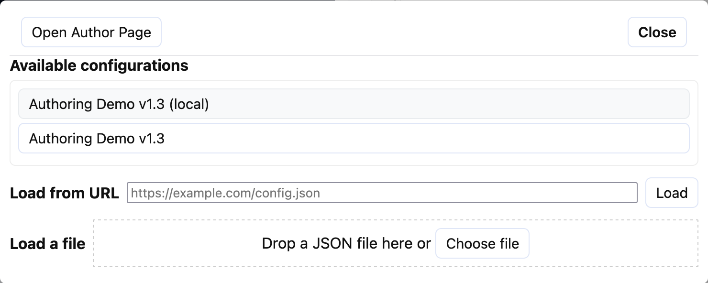

# Getting into the authoring interface

There are two ways to access the authoring interface:
- Directly via the URL: `app_path/author`
- Indirectly via activating authoring in the main app and then using in-app navigation

To activate authoring from the main app, add the `?author` parameter to the URL.
For example in the version on my site:
- `https://headtilt.me/clipy?author`

When the author setting has been activated, clicking on the name of the config in the
top-right:

  
The configuration name becomes a link when in authoring mode.

The configuration modal has a button for switching to the authoring page in the top-left.

The configuration modal also allows for loading config files in more ways than when in user
mode, such as uploading local files, listing and loading files from the server, and
loading configs that are being worked on locally in authoring.