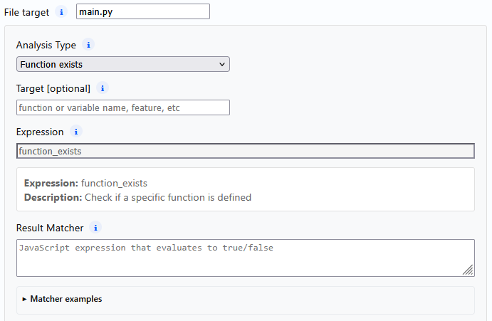
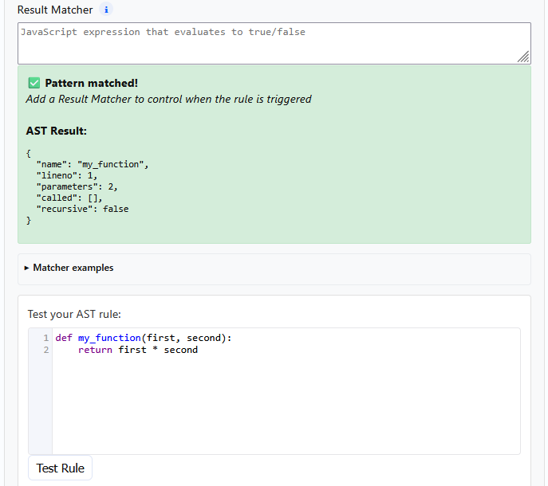

# Abstract Syntax Tree (AST) Rules

Abstract Syntax Trees (ASTs) can be used to give feedback or test the structure
of student code. Unlike pattern matching, this is a more reliable way of examining
what the user has actually written in their code. For example, pattern matching can
be fooled by having the pattern in a comment, but because the AST is generated from
parsing the code, it does not include non-code artefacts like comments, code-like
sequences in string literals and the like.

Clipy contains some generalised AST rules that can be used to analyse user code,
along with a matching system to determine what has been written. It isn't as
flexible as writing custom rules yourself, but is significantly easier to work
with.

## AST Rules

| Rule name | Rule Description |
| --------- | ---------------- |
| Function calls | Check for where functions are defined and called, including builtins like `print`. |
| Function exists | Check for whether a function has been defined, where it is called from, and whether it is recursive. |
| Function count | Similar to function exists, but more general information on how many and what functions are defined. |
| Variable usage | Information on what (non-parameter) variables have been defined, whether they have been modified, and where they have been used. |
| Control flow | Details about what control flows have been defined in the code and where they are used. |
| Has docstrings | **currently broken** |
| Code quality | Broad set of stats around code complexity. Combines many other rules. |
| Class analysis | Information on defined classes such as methods, method parameters, and info on individual methods like docstrings. |
| Import statements | Information on imports, type of import (`import`, `from X import Y`, wildcard) |
| Magic numbers | Attempts to identify magic number use. Some configuration available to fine-tune behaviour. |
| Exception handling | Information on try/except blocks, including which exceptions are handled. |
| Comprehensions | Identify different types of comprehensions, where they are used, and how (e.g. with an `if`) |

## Using the Rule Builder

