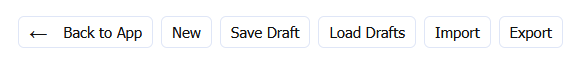
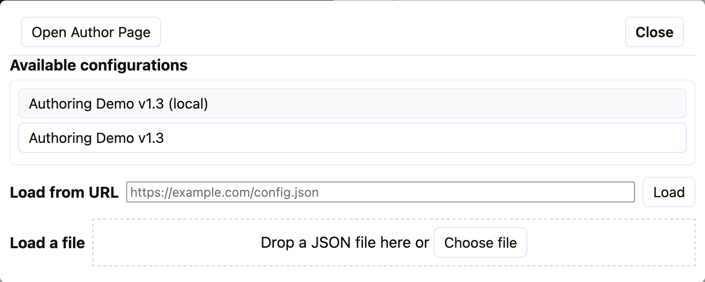
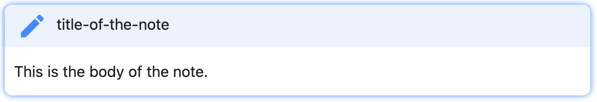

# The Authoring interface

## Working with config files

There are two parts of the authoring interface: problem authoring, and
configuration management. Because this is a client-side application there
is no server storage, syncing, etc of problem files. Instead, we can
work on drafts out of browser storage, or import and export JSON files.



### Drafts

Draft configurations can be saved and loaded from browser storage. This
allows you to work on multiple different problems, save different versions,
and test them until you are ready to export a file. Because this relies on
browser storage, changing web browser, computer, or using the app in private
browsing mode will affect whether you can see your prior versions.

> [!WARNING]
> Storage is managed through IndexedDB, so will be limited by anything
> that modifies the behaviour of that in the browser. Private browsing may
> prevent the use of IndexedDB, and editing files will be lost when a
> private window is closed.

Saving drafts will update any previously saved draft of the same config ID
and version. If the version is bumped then it will be saved in a new slot.

### Importing and exporting

Config files can be imported and exported from disk.

Exporting a config will use the config ID and version as the file name with
the `.json` file extension: `example-config@1.0.json`

> [!WARNING]
> Importing a config file will overwrite the current author config, so save
> a draft if necessary.

### The current author config

When working on a problem in the authoring interface, in addition to drafts,
a special slot is used in browser storage for the current problem config.

If you go back to the main app (in author mode, so either using the
**Back to App** button or using the `?author` URL parameter), you will see
an option in the config window opened be clicking on the config name to
load the `(local)` config. This will load the problem config currently
being worked on in authoring.

  
The config window with a `(local)` authoring config available.

## Building a problem configuration


### Metadata

Each problem configuration has the following metadata stored for it:
- Name (human friendly, used when displaying the problem)
- ID (machine-friendly, used when saving and loading drafts and snapshots)
- Version (major.minor semantic versioning, used by saving/loading)
- Description (only for authors)

### Instructions

Instructions for the user are written in [Common Markdown](https://commonmark.org/).

Syntax highlighting is provided for code fences. Code fences are defined with triple
backticks like this:

<pre>
```python
print("This is some Python code")
```
</pre>

Admonitions can also be inserted into your markdown. These are defined with tripe
exclamation marks, along with the style of admonition like this:

```txt
!!! note title-of-the-note
This is the body of the note.
!!!
```



Valid admonition types are:

|          |           |         |          |
| -------- | --------- | ------- | -------- |
| abstract | attention | bug     | caution  |
| danger   | error     | example | failure  |
| hint     | info      | note    | question |
| quote    | success   | tip     | warning  |

### Code & Files

Starter code for `main.py` and additional (text) file tabs can be provided here.
Binary files can also be uploaded.

[More about code and files here](code_and_files.md)

### Feedback

Feedback items can be provided as formative tools to guide users towards a
working solution (or alternatively away from undesirable techniques).

Feedback can be provided at edit-time or run-time with the intention that
it is provided with either a visible title and a hidden triggered message
for explicit guidance, or as a hidden title and triggered message that is
more of a just-in-time approach.

Find out about creating and configuring different types of feedback here:

- [Building string-based feedback](feedback_string.md)
- [Building regular expression-based feedback](feedback_regex.md)
- [Building AST-based rules](ast_rules.md)

### Tests

Tests are provided as summative tools to give users a sense as to
whether they have successfully solved the problem. 

The intention is to give the user a good sense of what is being tested
(and possibly why) with useful feedback about failures.

- [Building basic tests](tests_basics.md)
- [Conditional test runs](tests_conditional_runs.md)
- [Building test groups](tests_groups.md)

### Verification

Verification is a teacher tool rather than an author tool. It provides
a single place for a teacher to enter a number of student ID values, and
when different configurations are loaded the list will show the verification
codes to expect if each of the students passes all of the tests.