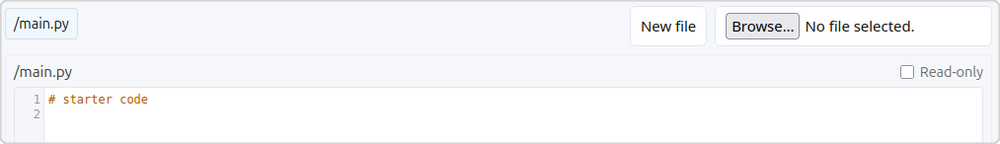

# Code & Files

> [!WARNING]
> Binary files aren't supported yet. They will cheerfully tell you they have uploaded and the tab
> contents will tell you it's a binary file and the file type, but don't be
> fooled, it's just text for now!
>
> The plan is to base64 encode any binary files. It's questionable how useful
> having access to binary files would be, considering that MicroPython doesn't
> have library support for things like image manipulation with PIL by default.

Add starter code and additional files to the default user workspace. The `main.py` file
is the file that will be run by the app and cannot be deleted or renamed.

Files can be marked read-only, preventing them from being modified (or deleted) by
the student via the UI or their code. Attempting to write to or delete a file that
is read-only will raise an `OSError` with an error number of `13`.

> [!INFO]
> At this point you can't rename files after you have added them.