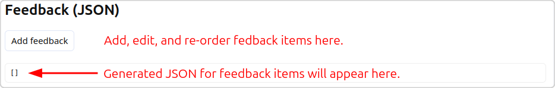
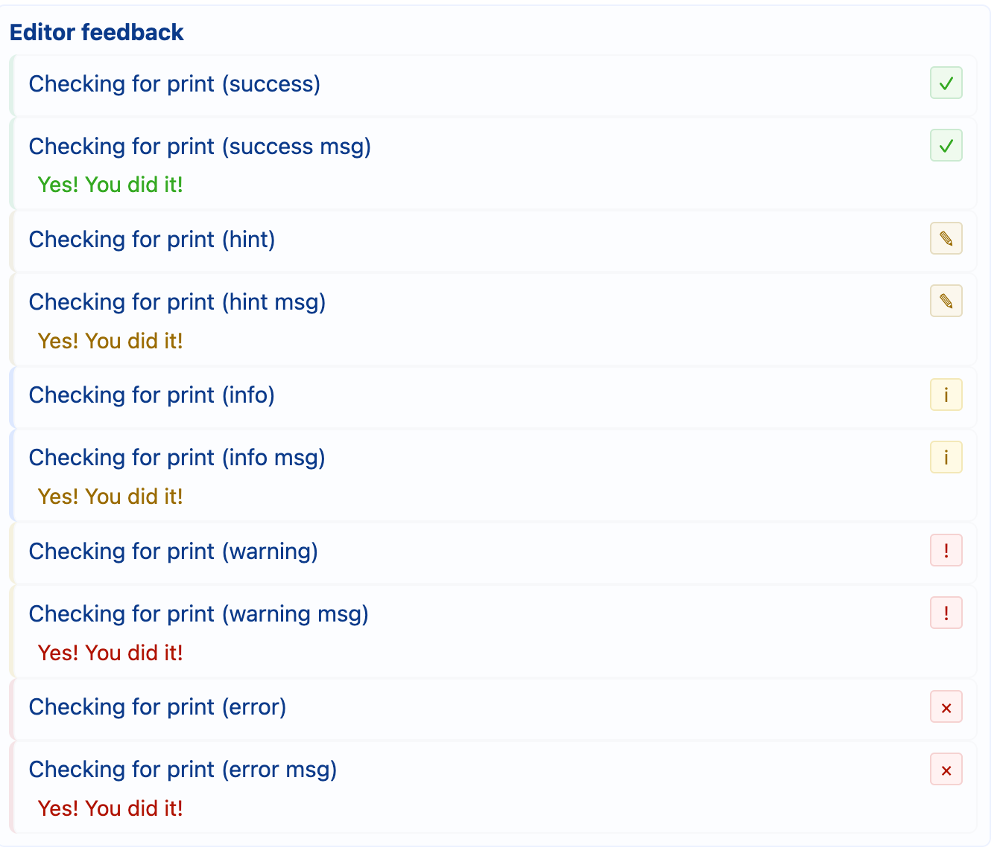

# Feedback Overview

Feedback is meant to be rules that are validated as the user writes code.
This should be guiding information, rather than a checklist, to avoid
being a crutch and to encourage the user to think about their code, not
ticking off boxes in a list of instructions.

Feedback rules have a number of configuration settings:
- **Title** - What the user sees in Feedback panel of the interface
- **ID** - Generated internal identifier, shouldn't need to be changed
- **When** - When the rule is evaluated. Most rules are "edit time" and so
are evaluated as the student is writing their code. "run time" rules are
more useful for checking suggested input values or for giving feedback on
errors
- **Visible by defualt** - Whether to show the rule if it hasn't yet been
triggered
- **Pattern type** - How the rule is checked. See the docs for [string](feedback_string.md),
[regular expression](feedback_regex.md), and [abstract syntax tree (AST)](ast_rules.md) types
- **Depends on** - Rule dependency can add other feedback items to the conditions for triggering this one
- **Pattern target** - Only for string and regex rules, what to pattern match against. The list
changes depending on whether the rule is for edit time or run time
- **File target** - Only for string and regex rules edit time rules, which file to check against
- **Message** - [Optional] What message to show to the user when the rule triggers. This will appear
below the *Title* of the feedback rule
- **Style** - Visual style of the feedback in the UI. Affects colour accent and icon on match

**Visual feedback styles:**

