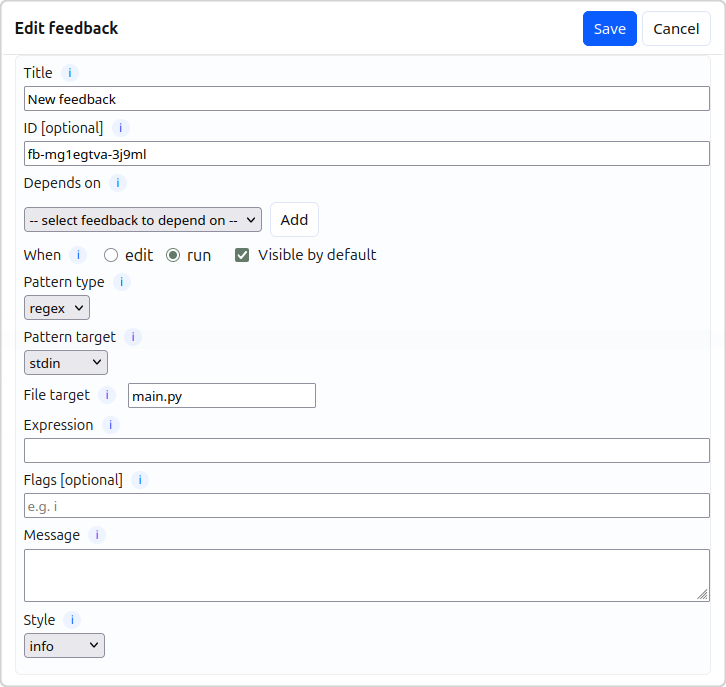

# Regular Expression Feedback

Regular expressions are a rabbit hole, but also a very powerful way of pattern matching that
can make your feedback rules less brittle than string matching. Regular expressions are built
around the idea of patterns that can flexibly match multiple different strings.

For example the pattern `bro+m` literally matches the `br` and `m` with one or more `o` in the
middle like `brom`, `broom`, and `broooom`.

A more useful example with optional matches (the `?` character) could be matching a `print` that
might include an f-string: `print\(f?.+\)` (parentheses and other characters that are used in
patterns need to be escaped to match the literal character).

Regular expressions can be tricky to learn but there are lots of resources out there to help.
This page is not about teaching you regular expressions, but about their use in this app. Here
are a couple of good sites:
- [Regex 101 - an interactive set of tutorials](https://regexlearn.com/learn/regex101)
- [Regexr - a tool for testing out your regex patterns](https://regexr.com/)
- [Do you want to know far too much about Regular Expressions?](https://en.wikipedia.org/wiki/Regular_expression)

Some games to help learn regex:
- [The regex game](https://www.the-regex-game.com/?level=integer)
- [Regex adventure](https://thinkwithgames.itch.io/regex-adventure)

## Creating Regex Feedback Rules

See the [feedback overview](feedback_overview.md) page for the basics of creating feedback rules.

The key differences with using regex feedback are:
- **Expression** - This is where you write your regular expression pattern (JavaScript syntax, but don't need the enclosing `/` characters)
- **Flags** - Any optional flags, such as multiline or ignore case ([see here for flag info](https://developer.mozilla.org/en-US/docs/Web/JavaScript/Guide/Regular_expressions#advanced_searching_with_flags))

