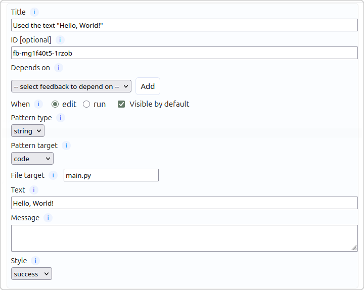
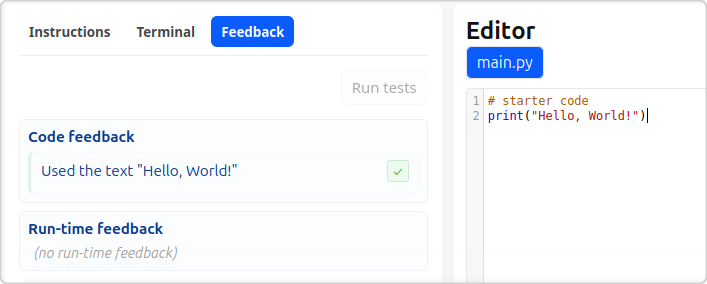
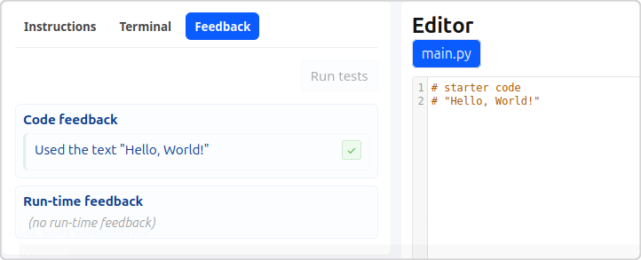

# String Feedback

String feedback is the simplest of the feedback rule types, checking whether
the specified string occurs anywhere in the specified target. Potential uses
could be:
- Checking whether specific text is used in the code
- Checking whether a particular file name was created in the user workspace

String feedback (like any pattern feedback) is relatively brittle, and may
give false positives or negatives depending on how the code is written, such
as by the user having the expected text in commented out code.

**Example:**  
This rule set up a simple text feedback rule to look for the text `Hello, World!`
in the user's `main.py` file.

In the following image you can see that they have done what was expected by
the author and `print`ed the string:

However, in this image you can see that they have put the text in a comment
and the feedback pattern still registers the rule as correct:

