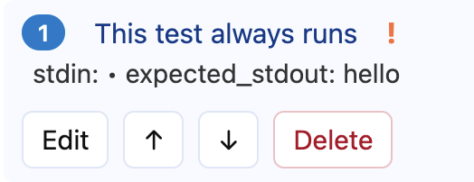
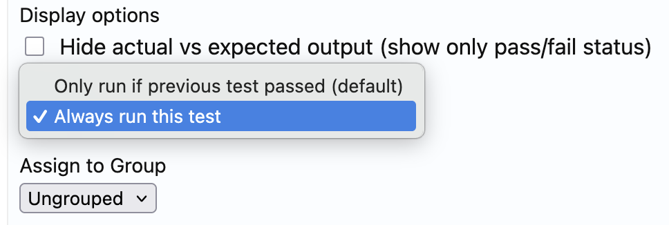
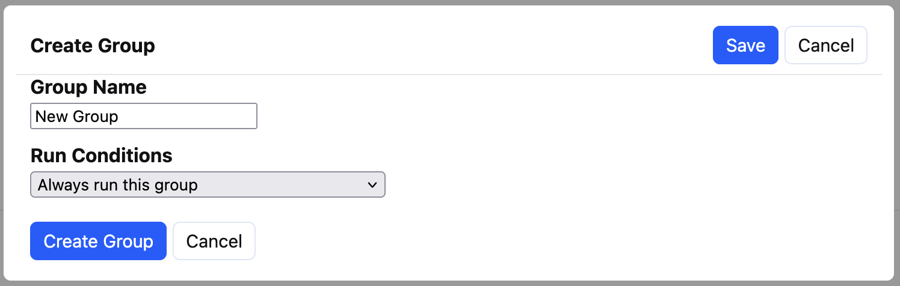

# Conditional Test Runs

> [!NOTE]
> The run condition of the first ungrouped test, and the first test of any
> group will be ignored in favour of a sensible default setting. The first
> ungrouped test should *always* run, and the first test in a group whose
> conditional run settings indicate it should run should also always run.
>
> This override has been put in place to make it easy for authors to reorder
> tests without worrying too much about their run conditions.

Tests and test groups can be set to either always run, or to only run if the
previous test or group passes.

Tests that are set to always run have a visual indicator (red `!` after the test description)
in the test list:

## Tests

For ungrouped tests (or tests within a group) this can be used to provide
progressively more detailed test feedback, or to rule out some behaviours in
order to make individual tests simpler to write. For example an early test
could check whether the correct input prompt was used, and later tests could
then test different input strings allowing the author to have the input
prompt in the stdio test with the confidence that an earlier test had
validated it.

## Groups

Entire groups of tests can be set to either always run, or only run if the
previous *group* has passed.

Within the group, tests will also follow their own conditional run settings.

For test groups, making test groups always run can allow test authors to
provide feedback about different aspects of the user program, for example
code structure (AST tests) in one group and stdio tests in another.