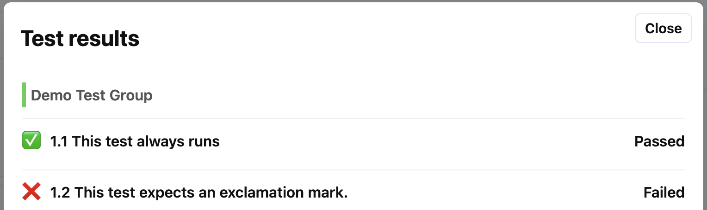

# Test Groups

Test cases can be put into test groups. This can be done for purely cosmetic
reasons, or to organised when tests are run.

Tests can be put into groups using the **Assign to group** option at the bottom
of each test case.

Tests that are in a group will be numbered according to the group (1.1, 1.2, etc)
whereas ungrouped tests are not numbered.

## User Visibility

Groups can be made visible to the user, which displays the Group Name in the
test UI. This setting will be applied to all test groups in the problem.

The group header looks like this to the user:

## Conditional Runs

See the [conditional runs](tests_conditional_runs.md) page for information about
group run conditions.

## Deleting Groups

If a groups is deleted, any tests that are contained in the group are moved to
the `ungrouped` section.