# Basic use

## Writing code

Write your Python code the same way you would with any editor. You have access to a basic CodeMirror
editor with tabbed file support. The editor will auto-save changes as you go for whatever file tab
you are in.

Your program will always be in the `main.py` file.

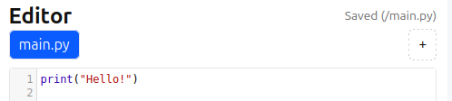

### Creating and deleting files

You can create your own files using the `+` button in the editor title bar.

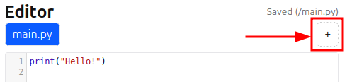

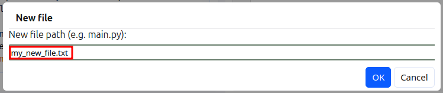

New files can be of any text type, e.g. `.txt`, `.py`, `.json` etc. New files will be visible to
your program code, and can be read from, written to, deleted, and created by your program.

You can delete your own files (except `main.py`) by using the small `x` in the file tab. This
can not be undone, although files are saved in your snapshots (see the **Saving code** section).

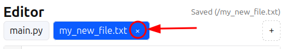

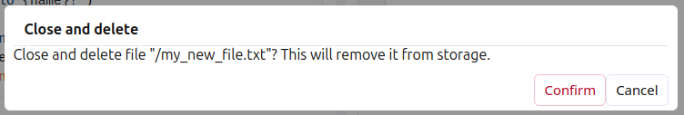

Some files that are provided as part of a problem are read-only. These can only be read by your
programs, and you can not manually delete them or delete them with your code.

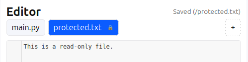

## Running code

Running your code is done by pressing the `Run` button at the bottom of the code editor.

> [!INFO]
> You can also use Ctrl-enter (Windows and Linux) or Cmd-enter (macOS) to run your code
> as long as the code editor has focus (i.e. you are editing your code).

The Terminal tab will automatically activate if it is not already when your code is run
to show you the output from your program.

When your program needs user input, the terminal will activate the the input field below
the terminal area. Pressing the `Send` button or pressing Enter on the keyboard will send
the input to your program. The input field will not be available when the program is not
requesting input.

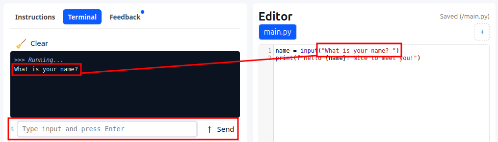

### Errors in your code

If there are errors when running your code, the error will be shown as a traceback in the
terminal as well as highlighting the line of code that the error refers to in the editor.

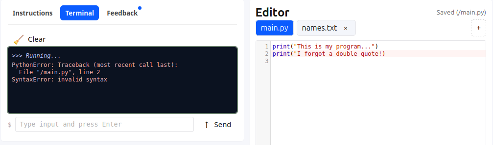

If there are errors in other files in your workspace, the editor will try and focus the
file that contains the error, and highlight all lines that were involved in the error.

The following example shows the imported error code being highlighted first,
but where calling code is imported in `main.py` is also indicated.

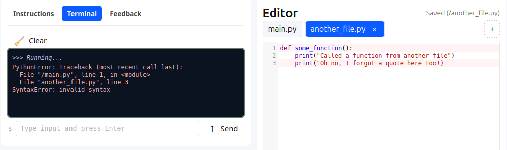

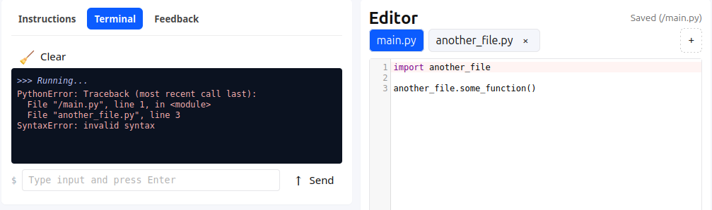

## Downloading code

If you want to take your code out of the editor and work on it elsewhere, use the `Download`
button under the code editor.

> [!INFO]
> If you only have `main.py` in your workspace, then a single Python file will be downloaded
> when you use the button. The name will be a combination of the problem configuration you
> are currently working on, its version, and the file name (which will be `main.py`)
>
> If you have multiple files in your workspace, the files will be combined into a `.zip`
> archive containing the name of the current problem configuration and its version.

## Saving code

Your code is automatically saved as your edit, so there is no manual save function. However,
there are snapshots that you can use to be able to explore a solution and then restore your
snapshotted code if required.

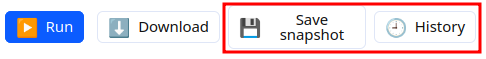

### Managing snapshots

When a problem configuration is loaded, a snapshot is automatically created for you. Using
the `Save snapshot` button will manually create a new snapshot checkpoint for you, with all
of your current code and files from your workspace.

Using the `History` button will show all snapshots you have stored for the current problem
configuration, showing the date, time, number of files in the snapshot, and size of data in
those files. There will always be a 'current' snapshot which is used for autosaves.

> [!NOTE]
> Code snapshots are stored in your browser's IndexedDB storage.
> This means that they will only be available when using the same
> browser and computer.

> [!WARNING]
> The `Clear storage` button will let you delete **ALL** snapshots across **ALL problem configurations**
> from your computer, including problems that you are not currently working on.
> As snapshots are usually quite small, this is not recommended.