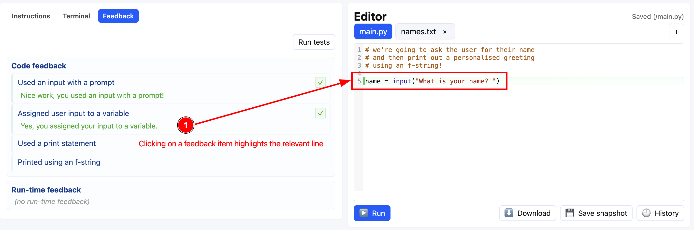
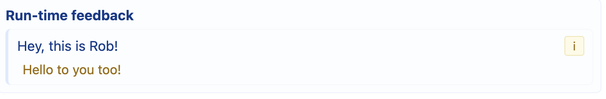

# Problem feedback

Problem authors can set feedback to automatically be shown or updated as your code changes
or when your code is run. This feedback can give you hints about whether you have used the
correct text, called the correct functions, or sometimes about how your code is structured.

## Where feedback appears and when

### The Feedback tab

Feedback appears in the **Feedback** tab, and is updated as your write your code. If a
feedback item no longer applies to your code, the item will be updated, so you may see
things appear or disappear as your program progresses.

When feedback appears, if it relates to patterns in your code, clicking on the feedback
item will highlight the code location it matches. This is more useful for warning and info
style feedback than success style feedback.

### The New Feedback indicator

If feedback appears when you have a different tab active, a *new feedback indicator* will
appear on the tab - a slowly pulsing blue dot.

You might see this indicator if:
- you are on the Instructions tab whilst writing your code
- you are in the Terminal tab running your code

When you return to the Feedback tab, the indicator will disappear. If you make a change
that causes new feedback to appear or old feedback to no longer be valid, the indicator
will appear again if you are no longer on the tab.

## Why feedback?

Sometimes we need a bit of a nudge, either towards something or away from something. Feedback
gives problem authors a way of giving formative advice *as a program is written*.

### Types of feedback

Authors have access to several different feedback variations when constructing a problem:
- Guiding feedback, which is always visible, or just-in-time feedback which is only visible when a rule becomes true
- Pattern matching on user code
- Code analysis from using the program's Abstract Syntax Tree
- Feedback which is evaluated a run time, to encourage testing

  
New feedback from a runtime indicator rule.

  
This rule was hidden until it triggered.
