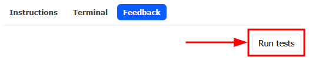
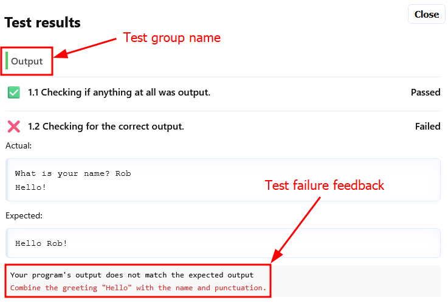
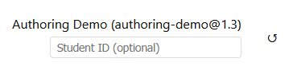
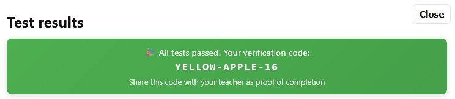

# Testing your code

When your code is complete it can be run through a series of tests that try and validate
what you have created. The tests can examine different aspects of your code and give you
feedback on what might be wrong if the test doesn't pass.

## Running tests

Tests are available through the **Run tests** button in the **Feedback** panel.

If no tests are configured for the problem you are working on, the button will be disabled
and show the fact there are no tests to run in the tooltip.

Depending on how the problem is configured, tests may run all at once, only if previous
tests pass, or in groups.

## Verification codes

If you are doing the problem as part of a class, you can optionally use a identifier, set
in the top-right of the page. When all of your tests are successful, if a student identifier
has been set, you will get a verification code show at the top of the test results window.

Your teacher will be able to verify that this code is correct for your student identifier
for the same problem configuration, on the same day.

> [!NOTE]
> The verification codes use the date as part of the check, so if it doesn't match up, make
> sure you and your teacher are checking on the same day.

## Types of tests

There are a number of test types that can be run against your code:
- Checking output text
- Running your code with different inputs
- Providing different file contents
- Checking whether any errors were raised
- Checking the code structure, for example whether variables were defined and also used
